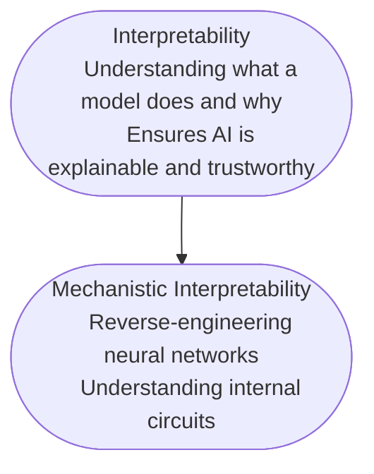

# Mechanistic Interpretability
*Understanding Neural Networks by Reverse Engineering*

<!--
Opening slide to grab attention.
This is where you'll introduce the topic and set the tone for the rest of the presentation.
-->

---
layout: two-cols
title: Overview
---

# My talk
- Today, we'll explore mechanistic interpretability through a **layered approach**, I like to start afar and zoom in.
- $\textrm{Intuition} > \textrm{maths}$ (in moderation)

::right::

<Transform :scale="0.8" origin="center">
  <Toc minDepth="1" maxDepth="1"></Toc>
</Transform>

<!--
- Mathematical rigour is important but not paramount.
- I want to equip people to go and seek knowledge themselves, so I'll focus on intuition and practical examples.
-->

---
title: Introduction
layout: two-cols
---

# What is Interpretability?

- Interpretability is the ability to **explain** or **present** in understandable terms to a human.

- More examples
- More examples
- More examples

::right::

<!--
Here, you can provide real-world analogies to make it more relatable.
E.g., "Imagine trying to fix a car without being able to look under the hood."
Spend around 5-7 minutes explaining this.
-->

---
title: Mechanistic Interpretability
---

# Mechanistic Interpretability
- Focuses on **how** neural networks learn and represent information.
- It’s about reverse-engineering a model to derive **human-interpretable algorithms**.
- Treat it as an ecosystem. There are **complex, emergent systems** that we can study much like the natural sciences.
- *Analogy*: Extracting source code from a compiled binary.
- *Goal*: Transforming black-box models into **transparent systems**.

Instead of just knowing *<ins>what</ins>* a model does, we want to understand *<ins>why</ins>* it does it.

<!--
- Moving away from treating neural networks as engineered system, and more as systems we study scientifically, like biological organisms or physical phenomena.  
- This is why you see the shift from handcrafted features to learnt representations, because it's too complex to handcraft, instead we learn state.
- We go with a data-driven approach and reverse-engineer the model after training to understand how it works.

-->

---
title: Representations are Key
---

# Representations are Key

I *really* want to stress this.

- **Predictive coding**: Like a neural network, our brain constantly updates its internal model of the world to minimise prediction errors.

<!-- 

Make points here on how a neural network takes in some data essentially twists and folds it into a representation that it can work with.
 -->

---
title: Why it matters
---

# Why Mechanistic Interpretability Matters
- **Modern Deep Learning is an alchemy!** Attempting to craft a useful representation of the world without understanding the underlying mechanisms.
- Fundamentally understanding the model's internal logic means we can model them and observe how they may behave in different scenarios. It also means we can begin **proving** properties about them and being able to **assure** that they will behave as expected.
- **Trust & Safety**: We can trust models because we understand how they work and we can ensure they are safe.
- **Debugging & Research**: Helps diagnose model failures, improves *robustness* and rapid prototyping.
- **Alignment**: Ensures models behave in ways aligned with human intentions.
- Overall, it’s about making AI systems **understandable and controllable**.

<!--
Emphasise how this work is directly tied to practical concerns in AI deployment.
Use examples like autonomous vehicles making life-critical decisions.
-->

---
title: "Case Study 1: Feature Visualization"
---
## Case Study 1: Feature Visualization

- Visualising neuron activations to see what features a network responds to.
- Example: Understanding how CNNs detect edges, textures, or object parts.
- This helps reveal **hidden biases** or **unexpected correlations** in the model.

<!--
Walk the audience through a simple example, like how an image classifier recognises cats vs. dogs.
Visual aids are key here — consider using diagrams to illustrate.
-->

---
title: "Case Study 2: Polysemantic Neurons"
---

## Case Study 2: Polysemantic Neurons

- **Polysemantic neurons** encode multiple, unrelated concepts.
- Example: A single neuron might respond to both "dog" and "snow" images.
- Implication: Networks are highly compressed but may develop **spurious correlations**.
- Can lead to model behaviours that are hard to predict.

<!--
Use this slide to discuss the efficiency-vs-complexity trade-off in neural networks.
Ask the audience for their thoughts on why compression might be a double-edged sword.
-->

---
title: "Case Study 3: Superposition in Neural Networks" 
---

# Case Study 3: Superposition in Neural Networks

- **Superposition**: Networks reuse neurons to represent multiple features, depending on context.
- This is an efficient use of resources but can lead to **overlapping activations**.
- Example: A neuron activates for both "striped patterns" and "tigers."

<!--
Explain how this concept ties into polysemantic neurons but with a focus on context.
Highlight the risks of superposition — like models making incorrect predictions when features overlap.
-->

---

# Deep Dive: Inductive Biases
- Neural networks have **built-in biases** due to their architecture.
- These biases influence what a model is likely to learn.
- Example: CNNs are biased towards spatial patterns, making them effective for images but less so for sequential data.
- Understanding inductive biases is crucial for **model robustness**.

<!--
This is a good point to ask the audience if they've ever noticed strange model behaviours
and tie it back to the concept of inductive biases.
-->

---

# Circuit Analysis: Discovering Modular Structures
- Mechanistic interpretability involves identifying **circuits** or **modules** within networks.
- These circuits act like **subroutines**, performing specialised tasks.
- Example: Circuits responsible for sentiment analysis in text models.
- Benefits:
  - Better debugging
  - More efficient models
  - Insight into how neural networks generalise

<!--
Use diagrams to show how different parts of a network handle different tasks.
Encourage questions here to engage the audience.
-->

---

# The Big Picture
- Mechanistic interpretability improves:
  - **Model safety**: Reducing harmful outputs.
  - **Efficiency**: Identifying and pruning redundant model parts.
  - **Alignment**: Ensuring AI aligns with human values and ethics.
- Future directions:
  - Applying mechanistic interpretability to **AI safety** research.
  - Using it to build more **trustworthy models** in critical applications.

<!--
This slide wraps up the core content.
You can transition into a discussion about the future of AI interpretability here.
-->

---

# Concluding Thoughts
- Mechanistic interpretability is still an **evolving field**.
- It has the potential to revolutionise how we understand and control AI systems.
- The future of AI depends on making these systems **transparent and trustworthy**.

<!--
Keep this concise. Reinforce the main takeaways and express optimism about future advancements.
-->

---

# Q&A
- Let’s discuss! What questions do you have?
- Are there any areas you’d like to dive deeper into?
- How can mechanistic interpretability impact your work?

<!--
Leave around 10-15 minutes for Q&A to engage with the audience.
This is where you can explore specific topics they’re curious about.
-->
