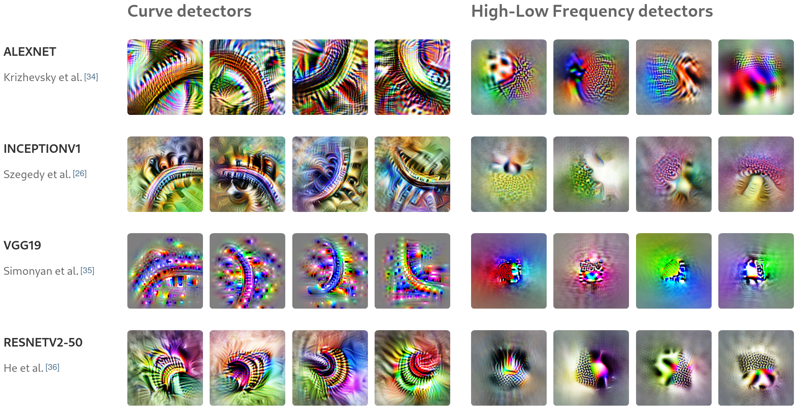

# Mechanistic Interpretability
*Understanding Neural Networks by Reverse Engineering*

<!--
Opening slide to grab attention.
This is where you'll introduce the topic and set the tone for the rest of the presentation.
-->

---
layout: two-cols
title: Overview
---

# My talk
- Today, we'll explore mechanistic interpretability through a **layered approach**, I like to start afar and zoom in.
- $\textrm{Intuition} > \textrm{maths}$ (in moderation)

::right::

<Transform :scale="0.6" origin="center">
  <Toc minDepth="1" maxDepth="1"></Toc>
</Transform>

<!--
- Mathematical rigour is important but not paramount.
- I want to equip people to go and seek knowledge themselves, so I'll focus on intuition and practical examples.
-->

---
title: Mechanistic Interpretability
---

# Mechanistic Interpretability

- Focuses on **how** neural networks learn and represent information.
- It’s about reverse-engineering a model to derive **human-interpretable algorithms** from its learnt weights and activations.
- Treat it as an **ecosystem**: complex, emergent systems that we study scientifically, much like biological organisms.

IS ECOSYSYTEM GOOD TO SAY HERE? IS IT WEIRD?

<!--- 
- Here we talk about interpretability, not explainability.
- Explainability is about providing a reason for a decision, while interpretability is about understanding the model's internal workings. We want to dig in here

- Moving away from treating neural networks as engineered system, and more as systems we study scientifically, like biological organisms or physical phenomena.  
- This is why you see the shift from handcrafted features to learnt representations, because it's too complex to handcraft, instead we learn state.
- We go with a data-driven approach and reverse-engineer the model after training to understand how it works.
-->

---
title: The Black-Box Analogy
---

# The Black-Box Analogy

<v-clicks>

- *Analogy*: Training a dog vs. debugging software:
  - With a dog, you only adjust behaviour based on outputs (*what you see*).
  - With traditional software, you can directly examine and fix the code.
  - Neural networks are more like training a dog — we adjust based on results without seeing the inner workings.

</v-clicks>

<v-clicks>

- The **black-box problem**:
  - Neural networks can perform well, but we don’t always know *how* or *why* they reach certain decisions.
  - Mechanistic interpretability aims to transform these black boxes into **transparent systems**.
  
We formulate a problem for a model to solve. It does it, we don't know how.

</v-clicks>

<!-- 
- The term "black-box" gets thrown around a lot..
- Reason is that the field is at the stage where we formulate a problem for a model to solve, and it does it. BUT we don't know how it does it.

-- Mention Andrej Kapathy's Software 2.0 blog post?

- This allows us to solve problems that are too complex to handcraft, but we lose the ability to understand how the model works.

 -->
---
title: Representations are Key
hide: true
---

# Representations are Key

I *really* want to stress this.

*What are representations?* 
<v-clicks> 

- Patterns that a model (whether biological or artificial) learns to make sense of inputs.
- Encoded in the weights and parameters of a model.

**Predictive coding**: Theory of brain function, idea that the brain constantly updates its internal model of the world to minimise prediction errors.

</v-clicks>

<v-clicks> 

*Deep Learning vs Predictive Coding*

- Neural networks: **Statistical patterns** stored in learnt weights.
- Brain: **Continuous interaction** with real-world feedback.

**Main takeaway**: Representations in neural nets are approximations of reality that are learned from data.

</v-clicks>

<!--
## Key points

- Predictive coding is a theory of brain function.
- Neural networks learn to model an approximation of reality.
  - Their "reality" is defined by the data they’re trained on.
  - They improve this approximation by minimising prediction errors (i.e., their loss function, which acts like a “score” for how well they’re doing).
    - The loss function is defined by artificial constraints we set.

- This approximation is essentially a representation of the world.

Now we've spoken about how models learnt representations, let's discuss **why it's crucial to understand them**. 
This isn't just theoretical, but has real-world implications for how we build safe and reliable AI systems.

-->

---
title: What Are Representations?
---

# Representations are Key

I *really* want to stress this.

*What are representations?* 
<v-clicks> 

- Neural networks learn **internal representations** of the inputs they've seen.
- These are **patterns** that help the model understand and process the data to perform its task.
- But it’s not just about isolated patterns — these patterns are **organised** into a structure.

(Diagram of raw data being transformed into representations)

</v-clicks>

<!-- Notes:
- Start by emphasizing that both biological and artificial systems rely on internal representations to process information.
- Mention that representations are essentially the model’s internal understanding of reality, encoded in its structure.
- Keep this simple to set the foundation. The audience should feel comfortable with the idea that a representation is an internal map.
-->

---
title: Patterns Within Representations
---

# Patterns Within Representations

<v-clicks> 

- Think of representations as the **model’s way of organising patterns** from its input data.
- These patterns can be **low-level** (e.g., edges, textures) or **high-level** (e.g., shapes, objects).

</v-clicks>

<v-clicks>

- The patterns are **not explicitly defined** — they are learned from data during training.
- These patterns are **grouped** and organised to form a cohesive internal understanding.

(Diagram of early vs deep layers in a CNN)

</v-clicks>

<!-- 

- Patterns are recurring structures or signals that a neural network detects in its input data.
  - For instance:
    - in images: edges, textures, or shapes
    - in text: words, phrases, or sentence structures, sentiment
    - in audio: pitch, tone, or phonemes

Notes:
- Explain that neural networks learn patterns autonomously. These patterns are stored in the network’s parameters.
- Emphasize that at the start of training, the model doesn't know anything — it gradually discovers patterns that help it fit to the data.
- Mention that these patterns are the building blocks for higher-level features.
-->

---
title: From Patterns to Features
---

# From Patterns to Features

<v-clicks>

- A **feature** is a meaningful combination of patterns that the model finds useful for its task.
  - smallest units of how neural nets encode knowledge, such that features cannot be further decomposed into smaller, distinct concepts  <Cite  input="10.48550/arXiv.2404.14082"/>
- For instance, detecting **edges** in an image is a low-level pattern that helps the model recognise objects like faces or cars.

</v-clicks>

<v-clicks>

- Features are **hierarchical** <Cite input="10.48550/arXiv.2006.13436" />:
  - Early layers detect simple patterns like **edges or textures**.
  - Deeper layers combine these patterns into more **complex structures** like shapes or object parts.

- **How does this all come together?**:
  - These features are not isolated but are organised in a **latent space**, where related features are grouped together.
  - This latent space is what allows models to make nuanced distinctions (e.g., distinguishing between different breeds of dogs).
(Diagram of a progression of features being combined to recognise a face)

</v-clicks>

MAYBE SIMPLIFY POINT ON LATENT SPACE?
- Data is projected into a latent space and it learns how to represent that data as some meaningful features
SPECIFICALLY COMPARE LATENT SPACE VS REPRESENTATION? SAME THING??

<!-- 

- A feature is a pattern that the model finds useful for its task. 
  - For example, detecting the shape of a cat's ear in an image.

- Features are hierarchical:
  - Early layers detect simple patterns like edges or textures.
  - Deeper layers combine these patterns into more complex structures like shapes or object parts.

- In neural networks, features are a pattern of activations across neurons that represent a specific concept.
  - For instance, a neuron might activate when it detects a vertical edge in an image.
- In DeepDream, maximising the activation of a specific neuron and trying to guess what it represents.

- This is where you make the transition from general patterns to specific features.
- Use a visual showing how a CNN identifies edges, textures, and then more complex features like faces.
- The key is to show that features are just patterns that have been identified as useful.
-->

---
title: Latent Space
---

# Latent Space

NOTE IMAGES AND STUFF

So here you train a language model to predict the missing word in a sentence,
You design the architecture in a way to have a bottle neck where the model has to learn a compressed representation of the sentence.
This compressed representation is the latent space.
Just so happens that semantics are encoded in this space, with similar sentences being close together.

<!-- 
- Neural networks look for patterns in data
- Features are meaningful patterns that the model has learnt to recognise in the data
- All these features are then organised in a latent space, grouping similar features together in a way that makes sense to the model and helps it to make decisions.
-->

---
title: Deep Learning vs Brain Representations
---

# Deep Learning vs Brain Representations

<v-clicks>

- In deep learning, the model's “reality” is **statistical** — based on the data we train it with.
- In the brain, reality is built from **continuous interaction** with the physical world.

</v-clicks>

<v-clicks>

- Neural networks learn from static data; the brain learns from **dynamic feedback**.
- *Predictive Coding (quick mention)*: The brain constantly updates its internal model to minimize prediction errors.

**Main takeaway**: Neural networks build approximations, whereas brains adapt to real-time feedback.

</v-clicks>

<!--
- Our brains also build representations of the world, but:
  - constrained by the laws of physics.
  - Brain's learning process is driven by survival and continuous physical interaction with our surroundings.
  - “reward function” is baked in by evolution

- In deep learning, however, we have to define the constraints and objectives ourselves:
  - What data to use
  - What loss function to use
  - What architecture to use
  - What hyperparameters to set, etc.
- Neural networks twist and fold data to build these learnt representations.
  - But, we don't know what the twists and folds mean, and why they even work.
-->

---
title: Why it matters
---

# Why Mechanistic Interpretability Matters

 
**Modern deep learning** is often like an **alchemy** - we see results without fully understanding the mechanisms behind them.

- **Trust & Safety**: 
  - Ensure decisions are *understandable* and *safe*.
  - Example: Autonomous vehicles making life-critical decisions
- **Debugging & Research**: 
  - *Diagnose* model failures and improve *robustness*.
  - Example: Image classfiers mistaking wolves for huskies due to snow in the background.
- **Alignment**
  - Align models with human values and ethical guidelines.
  - Example: Hiring algorithms that aren't discriminatory.

If we can model the inner workings of a neural network, we can better understand and control its behaviour.
<!--
Emphasise how this work is directly tied to practical concerns in AI deployment.
Use examples like autonomous vehicles making life-critical decisions.

- Deep learning has done some cool stuff but we don't know why it works.
- It would be really useful to know this for a few different reasons, that I've split up here.

- Trust & Safety (2018)
  - Death by an Uber self-driving car in 2018.
    - Didn't recognise her as she was jaywalking 
    - Couldn't classify objects as a pedestrian unless they near a crosswalk/zebra crossing
    - Braked just 1.3 seconds before impact,
  - IBM Watson recommending "multiple examples of unsafe and incorrect treatment recommendations"

- Debugging & Research
  - **TODO**: Add image example http://arxiv.org/pdf/1602.04938

- Alignment
  - **TODO**: Amazon (?) example

-->

---
title: Maximising activations
---

# Maximising Neuron Activations

<v-clicks>

- One way to understand what a neuron is detecting is to **maximise its activation**.
- By using **gradient ascent**, we adjust an input (usually noise) to maximize a neuron's response.
- This reveals what patterns or features the neuron is sensitive to.

</v-clicks>

  <!-- First image on the left -->
  

    
    
Activation Examples

  

  
  
  <!-- Stacked images on the right -->
  

    <!-- Top image -->
    

      
      
Optimising random noise

    

    <!-- Bottom image -->
    

      
      
Activation Features

      <Cite input="10.23915/distill.00007"/>
    

  

<!-- 
One way to interpret what a neuron is detecting is to maximise its activation.
- We take an input, generally random noise, and adjust it to maximise the neuron's response.
- Then after training, we can try to qualitatively interpret the image to understand what the neuron is sensitive to.

- You can either pick a neuron at random if exploring, or target specific neurons that show high activation when you pass through a real sample

- Purely optimising isn't so good because the network can cheat and find patterns that maximise the activation but aren't meaningful or don't necessarily correspond to human-interpretable features.
  - Things like lots of noise and nonsensical high-frequency patterns.
  - Don't fully understand why this happens, but seems related to strided convolutions and pooling operations.
  - This is where some regularisation, some kind of prior, or constraint is applied.
  - However am only scratching the surface here, and there's a lot more to this.

 -->

---
title: "Honourable Mention: DeepDream"
---

# Honourable Mention: DeepDream

  <!-- Left column with stacked images -->
  

    <!-- First DeepDream Image (Top) -->
    

      
    
 
    <!-- Third DeepDream Image (Bottom) -->
    

      
    

  

  <!-- Right column with single image -->
  

    
  

<!-- 
Example with DeepDream (2015):
  - Same concept, but starting with a real image and amplifying the activations in neurons that are already active.

- So. I've been talking about one way we can interpret models by specifically looking at what individual neurons are sensitive to.
- However, neural networks are not just isolated neurons doing their own thing, they are interconnected.
- Just like in our brains they collaborate to form larger structures
  - these structures are called circuits.
-->

---
title: "Circuits: Claims"
---

# Circuits: Claims

<v-clicks>

**Three speculative claims about neural networks**:

**Claim 1: Features**
- Features are the fundamental unit of neural networks.
- They correspond to directions. These features can be rigorously studied and understood.

**Claim 2: Circuits**
- Features are connected by weights, forming circuits.
- These circuits can also be rigorously studied and understood.

**Claim 3: Universality**
- Analogous features and circuits form across models and tasks. 

</v-clicks> 

<!-- 
This is all about zooming in now. 
In science as new tools are developed, we can see things we couldn't see before. 
  - For instance the microscope allowed us to see cells, and that opened up a whole new field of biology.
  - Atomic theory, subatomic particles, neuroscience, etc.

Remember, a feature is a pattern that the model finds useful for its task. 
  - For instance, detecting the shape of a cat's ear in an image.
  
A “circuit” is a computational subgraph of a neural network. It consists of a set of features, and the weighted edges that go between them in the original network.

- You can think of a circuit as an algorithm that the network has learned.
- Circuits perform a computation by processing inputs and generating outputs.
- They are discovered during training, so these algorithms are emergent, are more flexible and adaptive than handcrafted algorithms.
-->

---
title: "Circuits: Features"
---

# Circuits: Features

**Claim 1: Features**
- Features are the fundamental unit of neural networks.
- They correspond to directions. These features can be rigorously studied and understood.

{width=75%}

<!-- 

Direction here means a direction in the space of activations of the network. Latent, not directly observable.

- Claim 1:
  - Evidence to support idea that neural networks consist of meaningful, understandable features. 
  - Early layers detect simple patterns like edges or textures, while deeper layers combine these patterns into more complex structures like shapes or object parts.
  - Only scratching the surface here. Noteworthy are polysemantic neurons which fire for multiple concepts.

Considering this neuron here which appears to be a pose-invariant dog detector.
 -->

---
title: "Circuits: Connections"
---

# Circuits: Connections

**Claim 2: Circuits**
- Features are connected by **weights**, forming **circuits**.
- A circuit are akin to algorithms that the network has learnt.
- Circuits can be rigorously studied to understand how **complex behaviours** emerge.

<v-clicks>

  

</v-clicks>

<!-- 
Notes:
- Circuits consist of tightly connected features that the network has learned to combine in a meaningful way.

- **Example**: A circuit for recognising dogs
  - Combines detectors for eyes, fur textures, and snouts.
  - Image has two different pathways across three layers
  - You can see that each pathway is actually mirrored:
    - One is left-oriented, the other is right-oriented.
    - At each step the pathways actually try to inhibit each other to sharpen the contrast between them.
  - By the end he features are combined, giving you neurons which are invariant to the pose
- There is no reason that the network had to learn this structure at all!
- It could've just looked for a jumble of eyes, fur, and snout, but instead chose to recognise left/right orientation and to handle them separately
  
-->

---
title: "Circuits: Superposition"
---

# Circuits: Superposition
**Claim 2: Circuits**

<!-- 
Another example of a circuit from InceptionV1.
Looking at a neuron that detects cars.
You can see in this that the neuron looks for:
  - windows at the top and not at the bottom
  - wheels at the bottom and not at the top
  - and the car body, especially at the bottom
- then combines these features for a car detector. 

However something odd happens here  
 -->

---
title: "Circuits: Superposition"
hideInToc: true
---

# Circuits: Superposition
**Claim 2: Circuits**

<!-- 
The network decides to spread this car feature across many neurons!
In particular it is mixing up its car detector with dog detector!
- A neuron that responds to multiple concepts is called a polysemantic neuron.
In its world dogs and cars are deeply intertwined for some reason.
- The model deliberately taking this "pure neuron" and mixing it up with other features is known as superposition.
  - Similar to radio frequencies:
    - Radio frequencies are transmitted over the same medium (air) but at different frequencies
    - Frequencies can overlap which can lead to interference
    - But, you can use a fourier transform to decompose the signal into its constituent frequencies
    - Think of a feature as a frequency, and the deeper layers as the decomposition.
      - Network deciding whether an activation should be interpreted as "dog" or "car" based on the context.
    - 
- It is unknown why superposition occurs. Possibly to use fewer neurons to conserve them for other tasks.
- Means that as long as you don't have dogs and cars in the same image, in a later layer the dog feature can be retrieved.
  - Means you don't need to dedicate a neuron to each concept, but can share them across multiple concepts.

-->

---
title: "Circuits: Universality"
---

# Circuits: Universality

**Claim 3: Universality**
- Analogous features and circuits form across **different models and tasks**.
- Neural networks, even with varying architectures, tend to develop **similar internal features**.
- This phenomenon is known as **convergent learning**.

 

<v-clicks>

- For example, different vision models (like AlexNet, Inception, ResNet) independently develop detectors for:
  - **Edges, textures** in early layers.
  - **Curves, object parts** in deeper layers.

</v-clicks>

<!-- Notes:
- Universality suggests that neural networks may converge on similar solutions, even if trained separately.
- This is because certain patterns (like edges or curves) are universally useful for visual recognition.

If this was false then not completely bad at all.
- If we run with the cellular biology analogy, it would be like every species having cells with totally different organelles and proteins. If this were the case in real life we would only study humans and maybe a few other species.

-->

---
title: "Circuits: Universality"
hideInToc: true
---

# Circuits: Universality

**Claim 3: Universality**

<!-- 
Different architectures with different datasets all learn similar low and high-level features.
This implies there are universal patterns in natural images that neural networks independently discover.

 -->

---
title: "The Platonic Representation Hypothesis"
layout: two-cols
---

# The Platonic Representation Hypothesis
**Not Mechanistic Interpretability, but Deep Phenomena**

- This phenomenon hints at a form of **convergent learning**, where networks independently develop analogous representations, like a shared **latent structure** across models.

- **Relation to Universality**:
  - It suggests that certain **features are not just artifacts** of specific architectures but are instead **intrinsic to the data itself**.

::right::

  

<!-- Notes:

- Deep phenomena: emergent, recurring patterns or behavours in networks that arise naturally, reflecting intrinsic properties of the data or models themselves

- Based around the idea that e.g. images and text are projections of a common underlying reality, and that neural networks are learning to approximate this reality.
- Learning to approximate this REGARDLESS of modality or architecture or objective

- While mechanistic interpretability focuses on the **how** (reverse-engineering circuits), the Platonic Hypothesis focuses on **what** is being represented.

- So, the universality claim earlier shows that neural networks independently discover simiilar internal features and circuits
- Platonic Representation Hypothesis suggests that neural networks are trying to model fundamental patterns that reflect the structure of reality itself.

-->

---

# Concluding Thoughts
- Mechanistic interpretability is still an **evolving field**.
- It has the potential to revolutionise how we understand and control AI systems.
- The future of AI depends on making these systems **transparent and trustworthy**.

<!--
This is all new stuff, there is a lot that we are still learning and discovering.
One day we will have a grand unified theory of neural networks, but we are not there yet.
-->

---
title: Thank you!
hideInToc: true
---

# Thank you! 🐵

## Any questions?